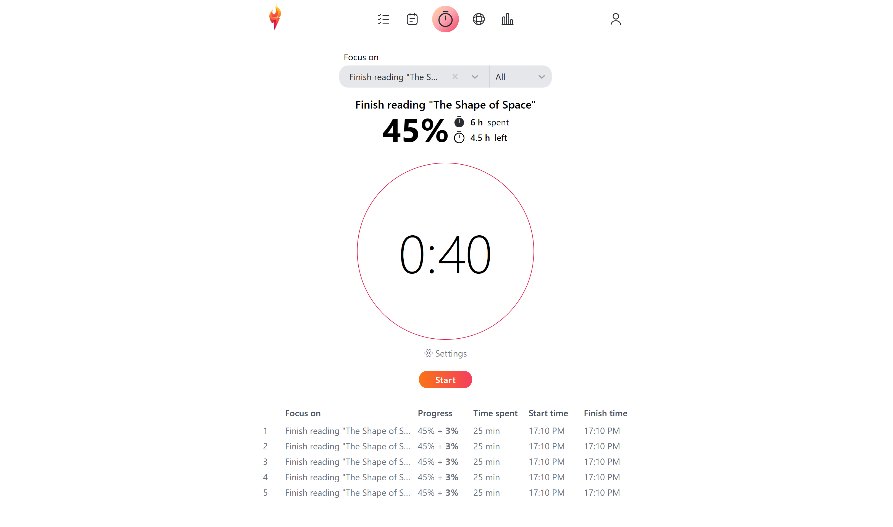

# Torch

An app that helps you track the time you spend pursuing your goals.

✅ Create tasks, goals, or dreams according to their size and scope.\
✅ Sort and filter your tasks according to priority, deadline date, and your current progress metrics.\
✅ Get visual feedback on your progress.\
✅ Use Pomodoro timer to track your time.

  

## TODO

Necessary

- [ ] Make a Not Found page
- [ ] Add percentage to each item strip
- [ ] Add some background
- [ ] Mark active page navlink
- [ ] Implement item "done" action
- [ ] Implement item "remove" action
- [x] Implement email waiting list
- [ ] Make so that the item list pathname could be /tasks or /dreams
- [x] Fix close icon position for modals
- [ ] Terms of service document
- [ ] Finalize recurring item functionality

Nice to have

- [ ] Adjust all sizes to make sure they look good on mobile
- [ ] Have the ability to reorder list items by dragging them
- [ ] Make timer toast text to slide infinitely (like Spotify)
- [ ] Implement item filter
- [ ] Add dark mode
- [ ] Add ability for users to add their social media links, description about themselves

If there's time

- [ ] Implement `prefers-reduced-motion` media query
- [ ] Try adding Million.js for smoother animations
- [ ] Add progress item bubble animation
- [ ] Add "Comming soon" tooltip to "Stats" action in edit item menu
- [ ] Add "Recurring task" tooltip to recurring tasks

Done

- [x] Tasks/Goals/Dreams list page
- [x] Task form modal
- [x] Goal form modal
- [x] Dream form modal
- [x] Refactor the modal component (if possible)
- [x] Make so that a user may work towards a goal when it has subtasks
- [x] Connect "start timer" button in goals list to the timer page
- [x] Add React Query
- [x] Investigate which state management library to use for forms and list page
- [x] Rewrite all of the state management in Goals list page with Jotai or Zustand
- [x] Add timer toast
- [x] Fix item input style in timer page
- [x] Add timer to tab title
- [x] Add fadeout gradient for lists
- [x] Limit animations in modal transitions to modal content instead of the whole modal
- [x] Make navbar sticky
- [x] Remake navbar to stick to the bottom of the screen on mobile
- [x] Save collapsed list items in local storage